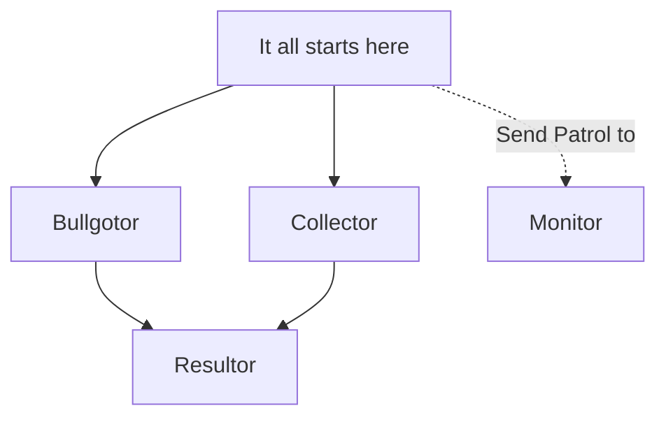
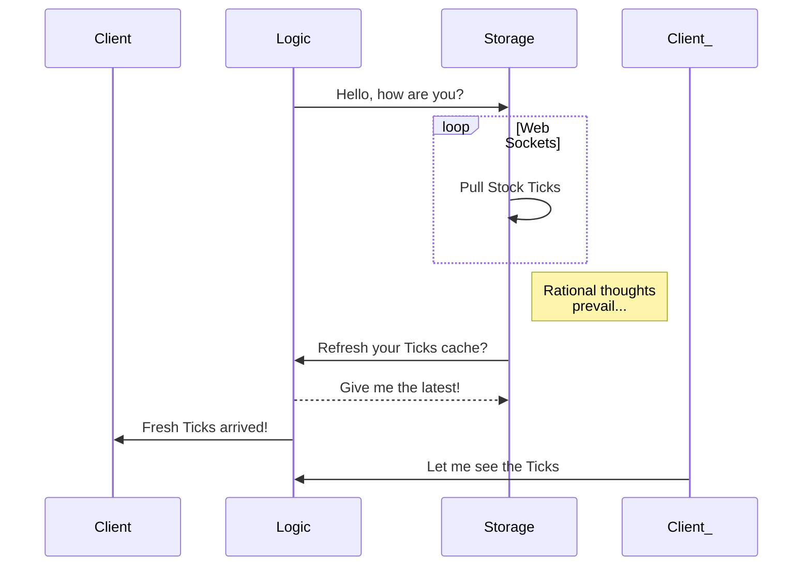
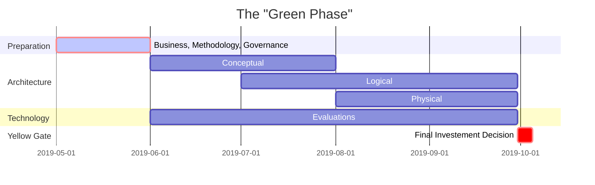

### Original date: 2019-05-15

## Plant UML

http://plantuml.com/index

- Very mature
- Well defined consistent syntax

```
@startuml

title Classes - Generics Diagram

package "Classic Collections" #DDDDDD {

class Vector< typename T > {
  int size()
  T & data (int idx)
}

class List< typename T > 
{
  - Vector<T> data_
  int size()
  T & data (int idx)
}

  Vector <-- List
}

@enduml
```
 **Rendering of the above** 
 


### Plant Text

**Very interesting "PlantUML" online ide: https://www.planttext.com**

## [Mermaid diagrams](https://mermaidjs.github.io/)

## Flowchart



## Sequence diagram



## Ganttogram


