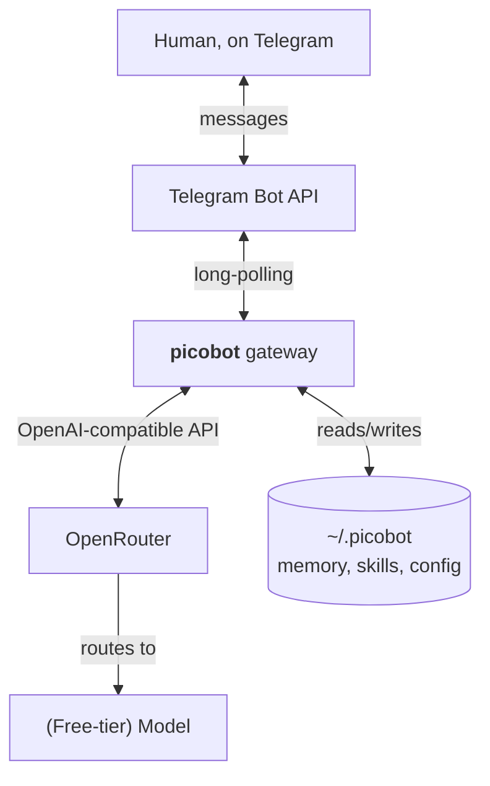
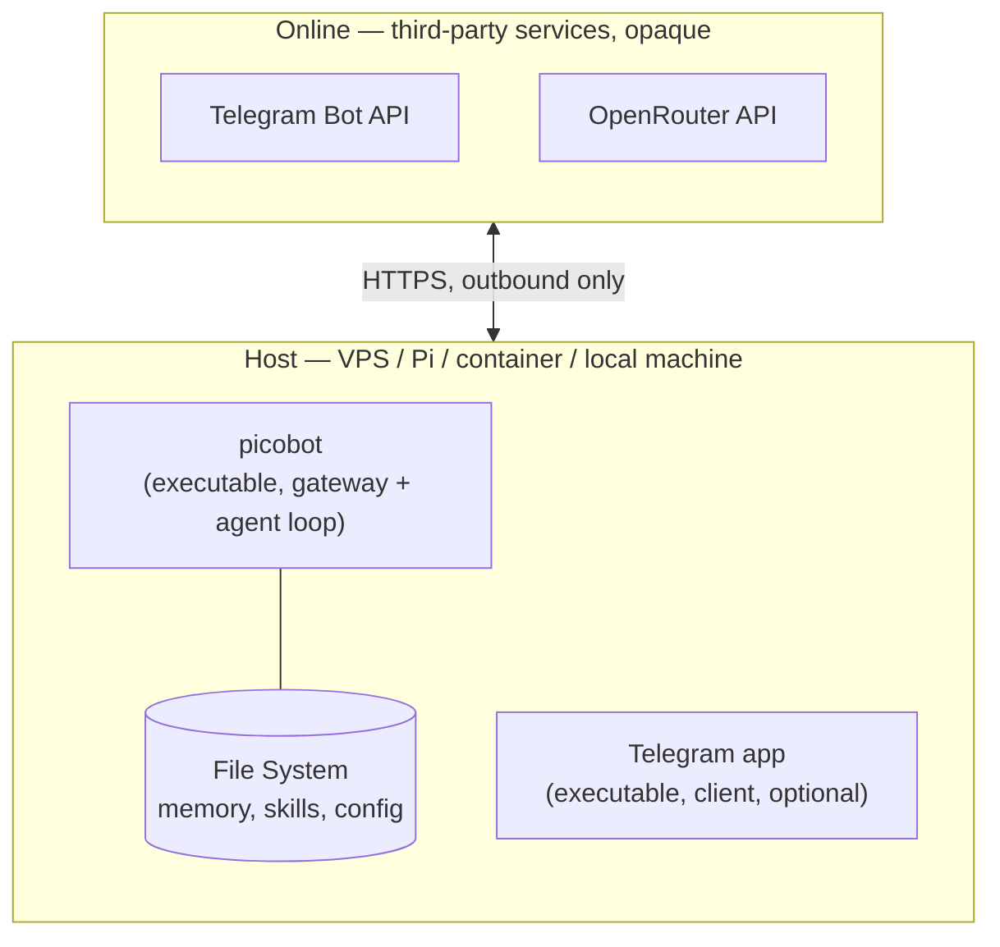

## Why **picobot**

[`louisho5/picobot`](https://github.com/louisho5/picobot) is a single-binary Go implementation of an LLM agent. Technically feasible choice for a lean, low-overhead utility footprint. (It compiles to a)  self-contained, statically linked binary with zero external runtime dependencies or heavy language runtimes. That means it is hosted on a minimal infrastructure, without framework bloat.

Plan is simple: [picobot](https://github.com/louisho5/picobot) with [OpenRouter](https://openrouter.ai/).

## [Physical Architecture](#physical-architecture-1)

Three main components: **picobot**, OpenRouter and (initially) Telegram.



### Physical Partitioning



On the "Host": the **picobot** process, local filesystem, and optionally, if user chats from the same machine, the Telegram client app itself. 

##  Runtime

{}
@BotFather is Telegram's official bot-creation tool: you message it, run /newbot, and it hands you an API token for a new bot (in this case, your picobot instance). It's how you provision a bot identity — it doesn't run your bot or relay its messages.
Telegram Bot API (the diagram node) is the ongoing message-relay service — the HTTPS endpoint your picobot gateway long-polls against to send/receive messages once the bot exists.
The flow is: talk to @BotFather once to get a token → configure picobot with that token → picobot then talks to the Telegram Bot API continuously for actual message traffic. @BotFather isn't in the  diagram because it's a one-time provisioning step, not a component in the running system.
{}


**picobot** is the only piece to host — a single binary (or its Docker image) holding the gateway process, the agent loop, and local state under `~/.picobot`. It keeps a long-poll connection open to the Telegram Bot API, so no inbound port or public IP is needed on the hosting side. Every message that comes in gets turned into a request to OpenRouter's OpenAI-compatible endpoint, which routes it to whichever LLM is configured, and the reply flows back through the same path to Telegram.

Nothing but **picobot** itself needs to be provisioned or maintained: Telegram and OpenRouter are both externally hosted, free-tier services reachable over plain HTTPS.

### Avoiding the OpenAI API cost

> Hint: OpenRouter is already decided

picobot talks to any **OpenAI-compatible API**, so it doesn't require an OpenAI token or an OpenAI bill. Two zero-cost paths:

- **Local LLM via Ollama** — run a model on your own hardware (Llama, Mistral, etc.), point picobot's base URL at `http://localhost:11434/v1` with a dummy API key. Data never leaves the machine, and token cost is strictly $0. Not an option if you can't host a local model.
- **OpenRouter's free tier** — OpenRouter hosts a selection of free open-source models behind an OpenAI-compatible endpoint. Runs entirely in the cloud, so it requires no local hardware or model hosting at all.

### Configuring picobot for OpenRouter

Get a free account and API key from [OpenRouter](https://openrouter.ai/), then point picobot at their endpoint:

```env
OPENAI_API_BASE="https://openrouter.ai/api/v1"
OPENAI_API_KEY="your-openrouter-key"
PICOBOT_MODEL="openrouter/free"
```

The model is your choice — set `PICOBOT_MODEL` (or the equivalent field in picobot's config file) to any identifier OpenRouter serves, free-tier or otherwise, for example `google/gemini-2.5-flash` or another open-source model on their platform.

### Telegram setup

picobot can talk over Telegram, Discord, Slack, or WhatsApp, but Telegram is the one worth wiring up first — it's the fastest path to a working agent users can chat with, from their phone, with no OAuth app review or workspace admin approval to wait on.

Setup is two minutes:

1. Message [@BotFather](https://t.me/BotFather) on Telegram and run `/newbot` — it hands you back a bot token.
2. Pass that token to **picobot** as the `TELEGRAM_BOT_TOKEN` environment variable, or set it under `channels.telegram.token` in `~/.picobot/config.json`.
3. Start the gateway (`picobot gateway`, or the Docker/Compose setup above) and message your bot.

```json
"channels": {
  "telegram": {
    "enabled": true,
    "token": "YOUR_TELEGRAM_BOT_TOKEN",
    "allowFrom": ["YOUR_TELEGRAM_USER_ID"]
  }
}
```

`allowFrom` is worth setting from the start — it restricts who can talk to the bot to your own Telegram user ID, since anyone who finds the bot's username can otherwise message it.

#### The (un)significant others

Discord and Slack integrations exist too, but both require registering an application through their respective developer portals and configuring bot permissions/scopes before the first message goes through. Telegram has no such gate — @BotFather issues the token immediately, which makes it the natural first channel to bring up.


## Vocabulary

#### Physical Architecture 

We use the [DBJ Taxonomy](https://method.dbj.org/taxonomy_core#canonical) as a common vocabulary. 


#### Is GO good in the context of AI?

GO4AI https://packagemain.tech/p/my-thoughts-on-the-future-of-go-in-ai-era . Just one opinion, but sober and connected to reality.